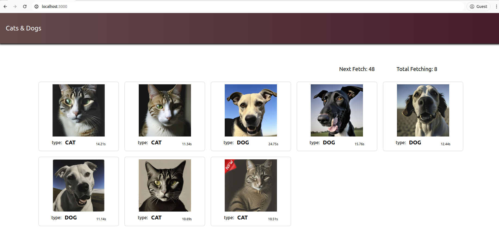

# Animal Classification

## Overview: 
You work with an API endpoint that generates images of cats and dogs as Base64-encoded files. The application accomplishes the following:

- Displays the last 10 images of cats and dogs, each tagged with the retrieval time, organized in two separate rows or columns.
- Automatically fetches and updates these images in real-time, even if the page isn't actively being viewed.
- Continuously updates the display in the background, showing the most recent images whether or not the client page is open.
- Includes a countdown for the next image request and a counter for the total number of images retrieved.
- Image classification should not rely on external APIs. Any approach, like a pre-trained ML model, is allowed as long as it is used locally.
- Please note that the rate limit is set to 1 request per minute.

#### Image Data Endpoint: `https://api.exactly.ai/v0/careers/cat-or-dog/69b31be8-8cf0-4697-b738-94bc13e878e0/`

## Intructions for local deployment

### Environment
- Frontend: React 18.0
- Backend: FastAPI 0.111.0
- Docker Version 24.0.5

### Running the service
You can just run the application by using `docker-compose` command:

```bash
docker-compose up --build
```

After composed up, you can open your browser and surf to `http://127.0.0.1:3000`.

## Working overview
The application fetching image data every 1 minute. Due to rate limiter, only 1 request is allowed per 1 minute (from both of backend and external api).

Every 60 seconds, it fetches animal information. Response body looks like:
```typescript
{
    url: <img_url>,
    fetch_time: <fetch_time>,
    type: <animal_type>,
    message: "Image Fetching Successed!",
}
```

### Dashboard Page

